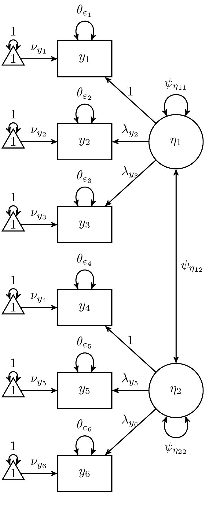

```{r, include = FALSE}
knitr::opts_chunk$set(
  collapse = TRUE,
  comment = "#>"
)
```

Equations can be specified without explicitly showing the error terms.
The two-factor confirmatory factor analysis example in the `Equations` vignette
can be specified as follows.


```
eq <- "
# items
## loadings
  eta[1] by y1 1
  eta[1] by y2 lambda[y2]
  eta[1] by y3 lambda[y3]
  eta[2] by y4 1
  eta[2] by y5 lambda[y5]
  eta[2] by y6 lambda[y6]
## intercepts
  y1 on 1 nu[y1]
  y2 on 1 nu[y2]
  y3 on 1 nu[y3]
  y4 on 1 nu[y4]
  y5 on 1 nu[y5]
  y6 on 1 nu[y6]
# errors
## Symmetric - error variances
  y1 with y1 theta[epsilon[1]]
  y2 with y2 theta[epsilon[2]]
  y3 with y3 theta[epsilon[3]]
  y4 with y4 theta[epsilon[4]]
  y5 with y5 theta[epsilon[5]]
  y6 with y6 theta[epsilon[6]]
# factors
## variances and covariances
  eta[1] with eta[1] psi[eta[11]]
  eta[1] with eta[2] psi[eta[12]]
  eta[2] with eta[2] psi[eta[22]]
## means
  eta[1] on 1 0 # There is no need to define equations for parameters constrained to zero.
  eta[2] on 1 0 # The following equations were added for completeness.
"
```

```{r, echo = FALSE}
eq <- "
# items
## loadings
  eta[1] by y1 1
  eta[1] by y2 lambda[y2]
  eta[1] by y3 lambda[y3]
  eta[2] by y4 1
  eta[2] by y5 lambda[y5]
  eta[2] by y6 lambda[y6]
## intercepts
  y1 on 1 nu[y1]
  y2 on 1 nu[y2]
  y3 on 1 nu[y3]
  y4 on 1 nu[y4]
  y5 on 1 nu[y5]
  y6 on 1 nu[y6]
# errors
## Symmetric - error variances
  y1 with y1 theta[epsilon[1]]
  y2 with y2 theta[epsilon[2]]
  y3 with y3 theta[epsilon[3]]
  y4 with y4 theta[epsilon[4]]
  y5 with y5 theta[epsilon[5]]
  y6 with y6 theta[epsilon[6]]
# factors
## variances and covariances
  eta[1] with eta[1] psi[eta[11]]
  eta[1] with eta[2] psi[eta[12]]
  eta[2] with eta[2] psi[eta[22]]
## means
  eta[1] on 1 0 # There is no need to define equations for parameters constrained to zero.
  eta[2] on 1 0 # The following equations were added for completeness. 
"
```

```{r, echo = FALSE, out.width = "70%", fig.cap="Two-Factor Confirmatory Factor Analysis Model"}

```

### EqParse

The `EqParse()` function can parse the defined equation
and setup labels for the unknown parameters.

```{r}
ramR::EqParse(eq)
```

### Symbolic

#### Eq2RAM

The `Eq2RAM()` function constructs
the RAM notation matrix representation of the model.
It also updates the parameter table to include
RAM notation information.

```{r}
RAM <- ramR::Eq2RAM(eq)
```

```{r}
RAM$par.table
```

```{r, echo = FALSE, results = "asis"} 
cat(
  "\\begin{align*}",
  "\\mathrm{variables}=",
  yacR::as.tex(yacR::as.ysym.mat(RAM$variables)),
  "\\end{align*}",
  sep = ""
)
```

```{r, echo = FALSE, results = "asis"} 
cat(
  "\\begin{align*}",
  "\\mathbf{A}=",
  yacR::as.tex(RAM$A),
  "\\end{align*}",
  sep = ""
)
```

```{r, echo = FALSE, results = "asis"} 
cat(
  "\\begin{align*}",
  "\\mathbf{S}=",
  yacR::as.tex(RAM$S),
  "\\end{align*}",
  sep = ""
)
```

```{r, echo = FALSE, results = "asis"} 
cat(
  "\\begin{align*}",
  "\\mathbf{u}=",
  yacR::as.tex(RAM$u),
  "\\end{align*}",
  sep = ""
)
```

```{r, echo = FALSE, results = "asis"} 
cat(
  "\\begin{align*}",
  "\\mathbf{F}=",
  yacR::as.tex(RAM$Filter),
  "\\end{align*}",
  sep = ""
)
```

#### Eq2Expectations

The `Eq2Expectations()` function constructs the
mean and covariance expectations.

```{r}
Expectations <- ramR::Eq2Expectations(eq)
```

The covariance expectations for all the variables
are given below.

```{r, echo = FALSE, results = "asis"} 
latex <- ramR::Eq2Expectations(eq, format = "tex")
cat(
  "\\begin{align*}",
  "\\mathbf{C}=",
  latex$C,
  "\\end{align*}",
  sep = ""
)
```

The scaled/standardized $\mathbf{C}$ matrix is given below.

$$`r latex$C.scaled`$$

The covariance expectations for the observed variables `y1` to `y6`
are given below.

```{r, echo = FALSE, results = "asis"} 
cat(
  "\\begin{align*}",
  "\\mathbf{M}=",
  latex$M,
  "\\end{align*}",
  sep = ""
)
```

The scaled/standardized $\mathbf{M}$ matrix is given below.

$$`r latex$M.scaled`$$

The mean expectations for all the variables
are given below.

```{r, echo = FALSE, results = "asis"} 
cat(
  "\\begin{align*}",
  "\\mathbf{v}=",
  latex$v,
  "\\end{align*}",
  sep = ""
)
```

The mean expectations for the observed variables `y1` to `y6`
are given below.

```{r, echo = FALSE, results = "asis"} 
cat(
  "\\begin{align*}",
  "\\mathbf{g}=",
  latex$g,
  "\\end{align*}",
  sep = ""
)
```

#### Scaled RAM Matrices

```{r}
RAM.scaled <- ramR::RAMScaled(
  A = yacR::as.ysym(RAM$A),
  S = RAM$S,
  Filter = RAM$Filter,
  C = Expectations$C,
  C.scaled = Expectations$C.scaled
)
```

$$
\mathbf{A}_{\mathrm{scaled}} = `r yacR::as.tex(RAM.scaled$A.scaled)`
$$

$$
\mathbf{S}_{\mathrm{scaled}} = `r yacR::as.tex(RAM.scaled$S.scaled)`
$$

### Numerical

Values can be placed on the `par.label` column.

[comment]: <> (Long parameterization)

```{r}
eq <- "
# items
## loadings
  eta[1] by y1 1
  eta[1] by y2 1
  eta[1] by y3 1
  eta[2] by y4 1
  eta[2] by y5 1
  eta[2] by y6 1
## intercepts
  y1 on 1 0
  y2 on 1 0
  y3 on 1 0
  y4 on 1 0
  y5 on 1 0
  y6 on 1 0
# errors
## Symmetric - error variances
  y1 with y1 0.50
  y2 with y2 0.50
  y3 with y3 0.50
  y4 with y4 0.50
  y5 with y5 0.50
  y6 with y6 0.50
# factors
## variances and covariances
  eta[1] with eta[1] 1
  eta[1] with eta[2] 0.50
  eta[2] with eta[2] 1
## means
  eta[1] on 1 0
  eta[2] on 1 0
"
```

#### Eq2RAM

The `Eq2RAM()` function constructs
the RAM notation matrix representation of the model.

```{r}
RAM <- ramR::Eq2RAM(eq)
```

```{r, echo = FALSE, results = "asis"} 
cat(
  "\\begin{align*}",
  "\\mathrm{variables}=",
  yacR::as.tex(yacR::as.ysym.mat(RAM$variables)),
  "\\end{align*}",
  sep = ""
)
```

```{r, echo = FALSE, results = "asis"} 
cat(
  "\\begin{align*}",
  "\\mathbf{A}=",
  yacR::as.tex(RAM$A),
  "\\end{align*}",
  sep = ""
)
```

```{r, echo = FALSE, results = "asis"} 
cat(
  "\\begin{align*}",
  "\\mathbf{S}=",
  yacR::as.tex(RAM$S),
  "\\end{align*}",
  sep = ""
)
```

```{r, echo = FALSE, results = "asis"} 
cat(
  "\\begin{align*}",
  "\\mathbf{u}=",
  yacR::as.tex(RAM$u),
  "\\end{align*}",
  sep = ""
)
```

```{r, echo = FALSE, results = "asis"} 
cat(
  "\\begin{align*}",
  "\\mathbf{F}=",
  yacR::as.tex(RAM$Filter),
  "\\end{align*}",
  sep = ""
)
```

#### Eq2Expectations

The `Eq2Expectations()` function constructs the
mean and covariance expectations.

```{r}
Expectations <- ramR::Eq2Expectations(eq)
```

The covariance expectations for all the variables
are given below.

```{r, echo = FALSE, results = "asis"} 
cat(
  "\\begin{align*}",
  "\\mathbf{C}=",
  yacR::as.tex(Expectations$C),
  "\\end{align*}",
  sep = ""
)
```

The covariance expectations for the observed variables `y1` to `y6`
are given below.

```{r, echo = FALSE, results = "asis"} 
cat(
  "\\begin{align*}",
  "\\mathbf{M}=",
  yacR::as.tex(Expectations$M),
  "\\end{align*}",
  sep = ""
)
```

The mean expectations for all the variables
are given below.

```{r, echo = FALSE, results = "asis"} 
cat(
  "\\begin{align*}",
  "\\mathbf{v}=",
  yacR::as.tex(Expectations$v),
  "\\end{align*}",
  sep = ""
)
```

The mean expectations for the observed variables `y1` to `y6`
are given below.

```{r, echo = FALSE, results = "asis"} 
cat(
  "\\begin{align*}",
  "\\mathbf{g}=",
  yacR::as.tex(Expectations$g),
  "\\end{align*}",
  sep = ""
)
```

#### Scaled RAM Matrices

```{r}
RAM.scaled <- ramR::RAMScaled(
  A = RAM$A,
  S = RAM$S,
  Filter = RAM$Filter,
  C = Expectations$C,
  C.scaled = Expectations$C.scaled
)
```

$$
\mathbf{A}_{\mathrm{scaled}} = `r yacR::as.tex(RAM.scaled$A.scaled)`
$$

$$
\mathbf{S}_{\mathrm{scaled}} = `r yacR::as.tex(RAM.scaled$S.scaled)`
$$

#### Eq2Data

The `Eq2Data()` function simulates data
from the multivariate normal distribution.

```{r}
Data <- ramR::Eq2Data(eq, n = 100000)
str(Data)
cov(Data)
colMeans(Data)
```
